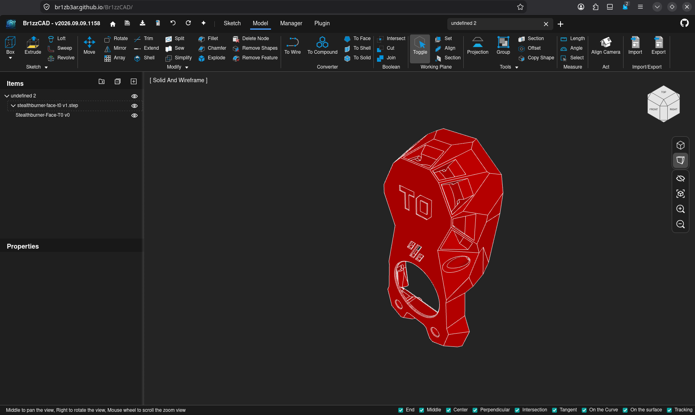

<p align="center">
  
</p>

# Br1zzCAD

A browser-based 3D CAD application for online model design and editing.



> **Br1zzCAD is a fork of [Chili3D](https://github.com/xiangechen/chili3d)** by 仙阁 (xiangechen), extended and maintained by [BR1ZB3AR](https://github.com/BR1ZB3AR). All credit for the original architecture, OCCT/WASM kernel, and the vast majority of this codebase goes to the upstream Chili3D project — see [Upstream](#upstream) below.

## Overview

Br1zzCAD is an open-source browser-based 3D CAD (Computer-Aided Design) application built with TypeScript. It achieves near-native performance by compiling OpenCascade (OCCT) to WebAssembly and integrating with Three.js, enabling powerful online modeling, editing, and rendering — all without requiring local installation.

## Features

### Modeling Tools

- **Basic Shapes**: Create boxes, cylinders, cones, spheres, pyramids, torus, and more
- **2D Sketching**: Draw lines, arcs, circles, ellipses, rectangles, polygons, and Bézier curves
- **Advanced Operations**:
    - Boolean operations (union, difference, intersection)
    - Extrusion and revolution
    - Sweeping and lofting
    - Offset surfaces and thick solid
    - Linear and circular arrays
    - Shape checking and repair

### Snapping and Tracking

- **Object Snapping**: Precisely snap to geometric features (points, edges, faces)
- **Workplane Snapping**: Snap to the current workplane for accurate planar operations
- **Axis Tracking**: Create objects along tracked axes for precise alignment
- **Feature Point Detection**: Automatically detect and snap to key geometric features
- **Tracking Visualization**: Visual guides showing tracking lines and reference points

### Editing Tools

- **Modification**: Chamfer, fillet, trim, break, split, sew, simplify
- **Transformation**: Move, rotate, mirror, linear array, circular array
- **Advanced Editing**:
    - Feature removal
    - Sub-shape manipulation
    - Explode compound objects

### Measurement Tools

- Measure angles and lengths
- Calculate the sum of length, area, and volume

### Document Management

- Create, open, and save documents
- Full undo/redo stack with transaction history
- Import: STEP, STP, IGES, BREP, STL, OBJ, 3MF
- Export: STEP, IGES, BREP, STL, PLY, OBJ

### User Interface

- Office-style ribbon interface with contextual command organization
- Hierarchical assembly management with flexible grouping capabilities
- Dynamic workplane support
- 3D viewport with camera controls and camera position recall
- Command context panel integrated into the viewport

### Plugin System

Br1zzCAD supports a runtime plugin system with dynamic loading via URL parameters (`?plugin=`). Example plugins include:

- **helloworld-js** / **helloworld-ts** — Demo plugins showcasing the plugin API
- **macro** — Create, edit, and run macros to automate repetitive tasks
- **visual-programming** — Visual programming with a node-based editor (powered by Rete.js)

### Localization

- **Multi-Language Support**: Built-in internationalization (i18n) with seamless locale switching
- **Current Languages**: Chinese (zh-cn), English (en), Portuguese — Brazil (pt-br)
- Contributions for additional languages are welcome

## Architecture

Br1zzCAD uses an npm workspace monorepo under `packages/` with an interface-driven, pluggable backend architecture:

```
web ──> builder ──> app ──> core
                  ──> i18n ──> core
                  ──> three ──> core
                  ──> ui ──> core + element
                  ──> wasm ──> core
                  ──> storage ──> core

element ──> core
```

- **`core`** — Abstract interfaces (`IShape`, `IShapeFactory`), math (`XYZ`, `Matrix4`, `Plane`), document model, reactive data (`Observable`, `Binding`, `PubSub`), `Result<T,E>`, transactions/undo/redo, commands, serialization, plugin system, service container, UI abstractions
- **`wasm`** — Concrete `ShapeFactory` calling into OCCT via Emscripten bindings
- **`three`** — Three.js viewport, camera controller, visual objects, highlighter, outline pass, gizmo, mesh export
- **`element`** — Custom reactive DOM elements (radio groups, expanders, data converters)
- **`ui`** — Application chrome: main window, ribbon/toolbar, property panels, project tree, dialogs, toast, status bar
- **`app`** — Concrete `Application`, body node classes, command implementations, `CommandService`, `HotkeyService`
- **`builder`** — `AppBuilder` with a fluent `.useIndexedDB().useWasmOcc().useThree().useUI().build()` chain and default ribbon layout
- **`i18n`** — Locale data (en, zh-cn, pt-br)
- **`storage`** — IndexedDB persistence layer
- **`web`** — Entry point: calls `AppBuilder`, shows loading screen, parses URL parameters

## Technology Stack

- **Frontend**: TypeScript, Three.js (0.184)
- **3D Kernel**: OpenCascade 8.0.0 (OCCT) compiled to WebAssembly via Emscripten
- **Bundler**: Rspack 2
- **Linting & Formatting**: Biome (TypeScript), clang-format (C++)
- **Testing**: Rstest + Happy-DOM
- **Package Manager**: npm workspaces

## Getting Started

### Prerequisites

- Node.js
- npm

### Installation

1. Clone the repository

    ```bash
    git clone https://github.com/BR1ZB3AR/Br1zzCAD.git
    cd Br1zzCAD
    ```

2. Install dependencies

    ```bash
    npm install
    ```

### Development

Start the development server:

```bash
npm run dev   # Launches at http://localhost:8080
```

### Building

Build the application:

```bash
npm run build
```

### WASM Build (Optional)

The prebuilt WASM module is included in the repository. If you want to build it from source:

1. Set up WebAssembly dependencies (one-time setup):

    ```bash
    npm run setup:wasm
    ```

2. Build the WebAssembly module:

    ```bash
    npm run build:wasm
    ```

### Testing & Linting

```bash
npm run test    # Run all tests (Rstest + Happy-DOM)
npm run testc   # Tests with coverage
npm run check   # Biome lint + auto-fix
npm run format  # Biome + clang-format across all files
```

### Docker

You can also deploy with Docker:

```bash
docker compose up -d   # Builds and serves the app at http://localhost:8080
```

## Code Style

- **TypeScript**: Biome for linting and formatting — 4-space indent, 110-char line width, double quotes, semicolons always
- **C++**: clang-format with WebKit style
- Interfaces prefixed with `I` (`IShape`, `ICommand`)
- `camelCase` functions/variables, `PascalCase` classes, `UPPER_SNAKE_CASE` constants
- Type-only imports: `import type { IFoo } from "..."`
- Pre-commit hooks via simple-git-hooks + lint-staged

## Contributing

We welcome contributions to this fork! Please feel free to submit pull requests or open issues against [BR1ZB3AR/Br1zzCAD](https://github.com/BR1ZB3AR/Br1zzCAD).

Before submitting a PR, run `npm run check` to ensure your code passes linting.

## Changelog

Notable changes to this fork, newest first. Versions follow the calendar scheme `vYYYY.MM.DD.HHMM`. For upstream Chili3D's own changelog, see [Upstream](#upstream) below.

### [v2026.09.11.1920](https://github.com/BR1ZB3AR/Br1zzCAD/releases/tag/v2026.09.11.1920) — 2026-09-11

- **Sketching**: Applied constraints (Coincident, Horizontal, ...) are now real, visible things — each one shows up in the Items tree under its sketch, with a small on-canvas badge at the point it applies to, and can be deleted like any other node (Delete key or right-click → Delete), fully undoable. Deleting a constraint removes it from the solver immediately, so the geometry it was holding together is free to move on its own again. Previously a constraint was invisible data with no way to remove it short of undoing the whole command that created it.

### [v2026.09.11.1116](https://github.com/BR1ZB3AR/Br1zzCAD/releases/tag/v2026.09.11.1116) — 2026-09-11

- **Sketching**: A Circle's center point can now be picked for constraints — e.g. Coincident between a circle's center and a line/triangle-corner endpoint, which previously did nothing since the center marker wasn't a genuinely pickable point (it was drawn but had no selectable geometry behind it). Fixed at the root: an extra, non-topological point (a circle/ellipse's center) now gets a real, standalone vertex behind its marker instead of only a visual dot, the same fix that also protects against another "picking a point silently does nothing" case for any future point of this kind.

### [v2026.09.11.1047](https://github.com/BR1ZB3AR/Br1zzCAD/releases/tag/v2026.09.11.1047) — 2026-09-11

- **Sketching**: Fixed two bugs that made picking a point for a constraint unreliable or crash outright. First, clicking a line's endpoint could throw `TypeError: a.point is not a function` instead of selecting it. Second — the real usability problem — a vertex marker's clickable radius was computed as a fixed world-space distance rather than a screen-space one, so the same click tolerance only actually covered the marker at one specific zoom level and was nearly impossible to hit at any other. Both are fixed: point picking now reads the position the picker already resolved instead of re-deriving it unsafely, and a vertex's hit radius is now computed in real screen pixels at the current zoom, matching how edges already behaved. Plain, precise clicks on line endpoints now work consistently.

### [v2026.09.10.1438](https://github.com/BR1ZB3AR/Br1zzCAD/releases/tag/v2026.09.10.1438) — 2026-09-10

- **Sketching**: Added the first phase of real geometric constraints — **Coincident**, **Horizontal**, **Vertical**, **Parallel**, **Perpendicular** and **Equal**, in a new Constraints group on the Sketch tab. Select the points a constraint applies to (Line endpoints and Rectangle corners for now) and click the constraint — a small numerical solver repositions the sketch to satisfy it, and the constraint stays stored on the sketch so any later edit (changing a line's length, say) re-solves and keeps it satisfied, not a one-time snap. An unsatisfiable pick is rejected with a toast rather than corrupting the sketch. Dragging a constrained point to see it live-resolve, and Concentric/Tangent/Midpoint/Symmetric for circles and arcs, are follow-up work.

### [v2026.09.10.1206](https://github.com/BR1ZB3AR/Br1zzCAD/releases/tag/v2026.09.10.1206) — 2026-09-10

- **Sketching**: A closed-loop sketch profile's faint fill (the real, non-construction kind) is now 20% opacity, up from 10%, so it reads more clearly as a filled region while sketching.

### [v2026.09.10.1059](https://github.com/BR1ZB3AR/Br1zzCAD/releases/tag/v2026.09.10.1059) — 2026-09-10

- **Sketching**: A closed-loop construction (dashed/blue) shape no longer shows a filled face — only a real (non-construction) closed profile reads as "this is a solid region" now, matching FreeCAD. Its interior stays click-selectable (the face geometry itself is unchanged), just invisible; this also fixes hovering/selecting a construction face from briefly then permanently revealing that fill, the same class of bug fixed for dashed edges in the previous release.

### [v2026.09.10.0958](https://github.com/BR1ZB3AR/Br1zzCAD/releases/tag/v2026.09.10.0958) — 2026-09-10

- **Sketching**: Construction geometry (dashed/blue) is now excluded from Extrude, Revolve, Loft and Sweep's profile pick, matching how FreeCAD and other CAD tools treat construction lines — they're a drawing guide, not real profile material. It's still usable as a reference for those same tools (e.g. a Revolve axis or a Sweep path), since only the "this becomes the solid" pick is filtered.

### [v2026.09.10.0925](https://github.com/BR1ZB3AR/Br1zzCAD/releases/tag/v2026.09.10.0925) — 2026-09-10

- **Sketching**: Fixed construction geometry (dashed/blue) losing its dashed look the moment it was hovered or selected — and staying stuck solid afterward, even after deselecting. Hover/select now use dashed variants of the highlight materials for dashed edges, and deselecting correctly restores the edge's own material instead of always falling back to the shared solid default.

### [v2026.09.09.1558](https://github.com/BR1ZB3AR/Br1zzCAD/releases/tag/v2026.09.09.1558) — 2026-09-09

- **Sketching**: Added a **Construction Mode** toggle (Sketch tab's Draw group) — turn it on and every shape you draw next with any sketch tool (Line, Rectangle, Circle, 3-Point Arc, Regular Polygon, Bezier) is created as construction/reference geometry from the start, rendered dashed in a distinct blue instead of the normal solid color. The Draw group's background tints while the mode is active so it's clear it's on; turning it off returns to normal geometry for anything drawn afterward. This builds on the per-line Construction Line toggle added earlier today, generalizing it into a mode that applies to every sketch tool up front rather than a manual toggle per shape.

### [v2026.09.09.1507](https://github.com/BR1ZB3AR/Br1zzCAD/releases/tag/v2026.09.09.1507) — 2026-09-09

- **Sketching**: Added a **Construction Line** toggle — select a line and click it (Sketch tab's Modify group, or the new "Construction" checkbox in the Properties panel) to mark it dashed reference/guide geometry instead of real profile geometry. This also fixed a real rendering gap: dashed mesh data was never actually honored for a body's own persistent edges, only for temporary preview overlays, so nothing drawn could ever render dashed before now.

### [v2026.09.09.1232](https://github.com/BR1ZB3AR/Br1zzCAD/releases/tag/v2026.09.09.1232) — 2026-09-09

- **Viewport**: Clicking a named view (Top/Front/Back/Left/Right/Bottom) on the navigation cube now snaps the camera to orthographic, so the view is genuinely flat — no more circles reading as ellipses or edges converging, matching how FreeCAD and most other CAD tools handle axis-aligned views. Orbiting to an edge/corner view leaves whatever projection mode you're already in untouched.

### [v2026.09.09.1158](https://github.com/BR1ZB3AR/Br1zzCAD/releases/tag/v2026.09.09.1158) — 2026-09-09

- **Sketching**: Diameter dimensions now draw a proper diameter callout — one line spanning across the circle through its center with an arrowhead at each end and an Ø-prefixed label, instead of a radius-style line from the center to one edge. Auto Dimension on a circular edge now produces this diameter dimension by default (the conventional circle callout); Radius Dimension remains its own explicit tool for the center-to-edge case.

### [v2026.09.09.1148](https://github.com/BR1ZB3AR/Br1zzCAD/releases/tag/v2026.09.09.1148) — 2026-09-09

- **Sketching**: The Sketch tab's Modify group now also has **Rotate**, **Mirror**, **Array**, **Trim** and **Extend**, plus a new **Boolean** group with **Intersect**, **Cut** and **Join** — the same tools already available in the Model tab, now usable on 2D sketch geometry without switching tabs. Shell stays Model-only, since it only applies to a 3D solid.

### [v2026.09.09.1138](https://github.com/BR1ZB3AR/Br1zzCAD/releases/tag/v2026.09.09.1138) — 2026-09-09

- **Build**: Fixed a deploy-caching bug — the app's JS/CSS bundle was always named `main.js`/`main.css`, so on GitHub Pages (which doesn't allow custom cache headers) a browser or CDN edge could keep serving an old bundle for a while after a new version deployed, showing a stale version number even on a hard refresh. Every build now gets a uniquely-named bundle, so a new deploy can never be masked by a stale cache again.

### [v2026.09.09.1123](https://github.com/BR1ZB3AR/Br1zzCAD/releases/tag/v2026.09.09.1123) — 2026-09-09

- **Sketching**: The Sketch tab's plane-picker is now **New Sketch** and can start a sketch on any existing face, not just the three TOP/FRONT/RIGHT reference planes — click a face on your model and the sketch plane lines up with it. The Model tab no longer duplicates 2D drawing tools (Line, Rectangle, Circle, Arc, ...) that already live on the Sketch tab; it now shows only 3D primitives and features (Box/Sphere/Cylinder/Cone/Pyramid, Extrude, Loft, Sweep, Revolve).

### [v2026.09.09.1049](https://github.com/BR1ZB3AR/Br1zzCAD/releases/tag/v2026.09.09.1049) — 2026-09-09

- **Items tree**: Right-clicking any node — a sketch, a 3D feature, a shape, a dimension — now opens a context menu with **Edit**, **Rename** and **Delete**. Edit re-enters a sketch (restoring its working plane and switching back to the Sketch tab) or, for anything else, just selects the node so its values are ready to edit in the Properties panel. Rename edits the name in place.

### [v2026.09.09.1007](https://github.com/BR1ZB3AR/Br1zzCAD/releases/tag/v2026.09.09.1007) — 2026-09-09

- **Sketching**: Fixed a real selection gap — a dimension could never be selected (and so never deleted) by clicking its line/arc in the viewport, only via its row in the Items tree; clicking it now selects and highlights it like any other shape. Moving a sketch now carries its dimensions along automatically, even when only the geometry is selected, not the dimension too. Picking a working plane now starts a named "Sketch N" group that collects everything drawn next, with a new **Finish Sketch** button that switches to the Model tab when done. The Dimension dropdown's default is now **Auto Dimension** — pick any edge and it infers Linear vs Radius for you; Diameter and Angle remain explicit choices.

### [v2026.09.09.0005](https://github.com/BR1ZB3AR/Br1zzCAD/releases/tag/v2026.09.09.0005) — 2026-09-09

- **Sketching**: Added an **Angle Dimension** tool to the Dimension dropdown — pick two straight edges and a placement point to get an arc dimension labeled in degrees (e.g. a Rectangle corner reads "90.00°"). Added a **Move** tool to the Sketch tab so a finished sketch, dimensions included, can be repositioned as a unit — previously a selected dimension silently didn't move along with its geometry, since it's drawn from its own absolute points rather than a per-node transform like everything else.

### [v2026.09.08.2240](https://github.com/BR1ZB3AR/Br1zzCAD/releases/tag/v2026.09.08.2240) — 2026-09-08

- **Sketching**: Linear Dimension now picks the edge directly (Line, or one side of a Rectangle) instead of clicking two separate points — fixes a case where the dimension's label couldn't be double-clicked to edit because the second point-click didn't reliably resolve back to the shape it landed on. Dimensioning a Rectangle's side is now editable too, not just a Line. The label can also be dragged to pull the dimension line closer to or further from what it measures.

### [v2026.09.08.2048](https://github.com/BR1ZB3AR/Br1zzCAD/releases/tag/v2026.09.08.2048) — 2026-09-08

- **Sketching**: Added a **Dimension** tool group (Linear, Radius, Diameter) to the Sketch tab. Pick two points (or a circle) plus a placement point to get a SolidWorks-style dimension — extension lines, arrows, and a value label. Double-click the label to edit the value in place; editing a Line's length or a Circle's radius/diameter writes the new value straight back to that shape. Scoped down from full FreeCAD-style constraint dimensioning: no 2D solver, no cross-shape constraints — an edit only drives the single shape it measures.

### [v2026.09.08.1902](https://github.com/BR1ZB3AR/Br1zzCAD/releases/tag/v2026.09.08.1902) — 2026-09-08

- **Sketching**: Every sketch shape now shows a small node marker at each endpoint/corner (and at the center for Circle/Ellipse). Closed profiles (Rectangle, Circle, Ellipse, Polygon) now render at 10% fill opacity instead of fully invisible, so they read as a faint tint rather than disappearing entirely; open shapes (Line, Arc, Bezier) are unaffected.

### [v2026.09.08.1813](https://github.com/BR1ZB3AR/Br1zzCAD/releases/tag/v2026.09.08.1813) — 2026-09-08

- **Sketching**: Added **3 Point Circle**, **Circumscribed Polygon**, and **Elliptical Arc** to the Sketch tab's tool splits. Conic and true interpolating Spline tools aren't included — OCCT support for those isn't exposed by this build's WASM bindings, and adding it needs a C++/WASM rebuild this environment can't do.
- **Sketching**: 2D sketch profiles (Rectangle, Circle, Ellipse, Polygon, and their variants) now render as a transparent outline instead of a solid gray fill, closer to how a sketch looks before it's extruded.

### [v2026.09.08.1722](https://github.com/BR1ZB3AR/Br1zzCAD/releases/tag/v2026.09.08.1722) — 2026-09-08

- **Sketching**: The three reference planes shown by "Sketch Plane" are now translucent instead of solid gray, and their Top/Front/Right labels sit inside each plane's own visible area instead of dangling off to the side near the origin axes.

### [v2026.09.08.1651](https://github.com/BR1ZB3AR/Br1zzCAD/releases/tag/v2026.09.08.1651) — 2026-09-08

- **Sketching**: "Sketch Plane" no longer opens a dialog — it now shows three translucent Top/Front/Right reference planes directly at the origin in the viewport, and you click one there to set the workplane, same as picking a face on a real part.

### [v2026.09.08.1607](https://github.com/BR1ZB3AR/Br1zzCAD/releases/tag/v2026.09.08.1607) — 2026-09-08

- **Viewport**: The nav cube now has chamfered edges and corners (26 clickable facets total, up from 6), matching the standard SolidWorks/Fusion-style ViewCube — click an edge bevel for a diagonal two-face view, a corner bevel for an isometric-style three-face view, not just the 6 flat faces. The hovered facet highlights in blue.

### [v2026.09.08.1307](https://github.com/BR1ZB3AR/Br1zzCAD/releases/tag/v2026.09.08.1307) — 2026-09-08

- **Viewport**: The navigation widget in the top-right corner is now an actual 3D cube (TOP/BOTTOM/FRONT/BACK/LEFT/RIGHT labeled faces) instead of a flat X/Y/Z axis-bubble diagram — click a face to snap the camera to that view, drag to orbit, same as before.

### [v2026.09.08.1205](https://github.com/BR1ZB3AR/Br1zzCAD/releases/tag/v2026.09.08.1205) — 2026-09-08

- **Sketching**: Picking a plane on the Sketch Plane cube now shows it as a grid in the viewport, positioned and oriented to match, instead of leaving you looking at bare origin axes with no sense of where you're about to sketch. The grid follows any later workplane change too (Set/Align/Section working-plane commands).

### [v2026.09.08.1139](https://github.com/BR1ZB3AR/Br1zzCAD/releases/tag/v2026.09.08.1139) — 2026-09-08

- **Sketching**: Added a **Sketch** tab (left of Model). Its first button opens a rotatable 3D cube for picking the plane to sketch on — Top/Bottom, Front/Back, Right/Left, mapped to the XY/ZX/YZ planes — drag to spin it, click a face to set the workplane and jump straight into the sketch tools. Also added **Midpoint Line** (draws symmetric about the first point you pick), **Center Rectangle**, and **Aligned Rectangle** (a 3-point rectangle that can sit at any angle, not just axis-aligned) alongside the existing Line and (corner) Rectangle tools.

### [v2026.09.08.1040](https://github.com/BR1ZB3AR/Br1zzCAD/releases/tag/v2026.09.08.1040) — 2026-09-08

- **Import**: STL import now checks a file's triangle count before attempting the real import, rejecting anything over 50,000 triangles with a clear message instead of hanging for a minute or crashing the WASM runtime outright — reproduced with a real 460k-triangle STL that ran into a "RuntimeError: null function" crash requiring a page reload. Import errors also now show the actual failure reason instead of always saying "Unsupported file type".
- **Viewport**: Added a Hide/Show toggle (eye icon, next to Fit Content) for the world origin's Blue Z / Green Y / Red X axis indicator.

### [v2026.09.08.1004](https://github.com/BR1ZB3AR/Br1zzCAD/releases/tag/v2026.09.08.1004) — 2026-09-08

- **UI**: Pinned **Import** to the always-visible quick-access toolbar (next to Save/Undo/Redo), so it's no longer buried near the end of a long, horizontally-scrolling ribbon.
- **Cleanup**: Removed the WeChat ribbon entry — it linked to the upstream Chili3D author's personal WeChat group, not relevant to this fork.

### [v2026.09.08.0939](https://github.com/BR1ZB3AR/Br1zzCAD/releases/tag/v2026.09.08.0939) — 2026-09-08

- **Import**: Added support for opening **OBJ** and **3MF** files. OCCT (the CAD kernel) has no reader for either format in this build, so both are parsed directly in TypeScript (3MF's zip container via `jszip`) and built into a faceted shape — the same tier of geometry STL import already produces. Best suited to small-to-medium meshes; very large files (20,000+ triangles) aren't supported yet, since each triangle currently costs its own kernel call. STL and STEP/STP import were already supported.

### [v2026.09.07.1919](https://github.com/BR1ZB3AR/Br1zzCAD/releases/tag/v2026.09.07.1919) — 2026-09-07

- **Navigation**: Added a **FreeCAD** 3D navigation preset matching upstream FreeCAD's default "CAD" style (Middle+Left / Middle+Right chord or Shift+Right to rotate, Middle or Ctrl+Right to pan, Ctrl+Shift+Right to zoom-drag). Fixed the **TinkerCAD** preset, which had the wrong bindings — it's now Middle to pan, Right to rotate, matching FreeCAD's own bundled TinkerCAD style.
- **Extrude**: Now accepts multiple selected edges/wires (not just one pre-built face), joining them into a face automatically — so a profile sketched as several separate Line segments can be extruded directly without a manual conversion step. Shows a clear error toast if the picked edges don't form a closed loop, instead of silently sweeping the wrong shape.
- **Sketching**: The Line tool now detects when a connected chain of segments closes back on its own starting point and automatically converts it into a face — closing a sketch loop makes it immediately selectable and extrudable.
- **Selection**: Widened the on-screen pick tolerance for edges and lines, so a thin sketch line sitting flush on a larger face (e.g. on top of a box) is much easier to click without grabbing the face underneath by mistake.
- **Deployment**: The app now auto-builds and deploys to GitHub Pages on every push to `main` — live at [br1zb3ar.github.io/Br1zzCAD](https://br1zb3ar.github.io/Br1zzCAD/).

## Upstream

This project began as a fork of [xiangechen/chili3d](https://github.com/xiangechen/chili3d). For the original project — its official deployment, changelog, discussions, and commercial licensing inquiries — see:

- Upstream repository: [github.com/xiangechen/chili3d](https://github.com/xiangechen/chili3d)
- Official site: [chili3d.com](https://chili3d.com)
- Upstream changelog: [releases](https://github.com/xiangechen/chili3d/releases)

## License

Distributed under the GNU Affero General Public License v3.0 (AGPL-3.0), the same license as upstream Chili3D.

Full license details: [LICENSE](LICENSE)

The C++ WASM module (`cpp/`) is licensed under LGPL-3.0.

## Disclaimer

This software is provided "AS IS," and the authors and contributors hereby disclaim all express and implied warranties. The user shall bear full responsibility for any and all risks and potential consequences arising from the use of this software. Such risks and consequences include, but are not limited to:

1. Data loss, system failures, or any direct or indirect damages;
2. Conduct violating applicable laws or regulations resulting from software usage and its consequences;
3. All liabilities arising from the software's use for illegal purposes or activities.
